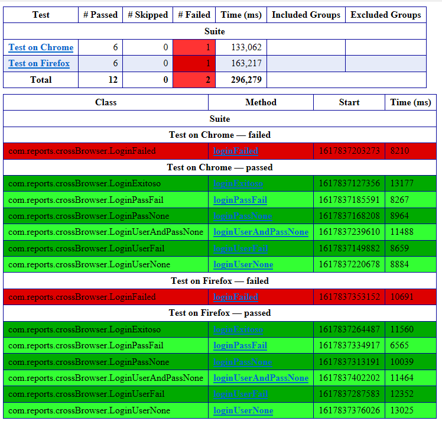

# crowdar-challenge

## Requerimientos del Sistema:
+ Windows 10
+ git client: https://git-scm.com/downloads
+ Eclipse IDE 2021‑03: https://www.eclipse.org/downloads/
+ java version "1.8.0_281" o superior
+ Google Chrome Versión 89.0: https://www.google.com/intl/es/chrome/

## Instalación
+ git client: [Tutorial de instalación](https://www.atlassian.com/git/tutorials/install-git)
+ set JAVA_HOME en windows 10: [Tutorial](https://javatutorial.net/set-java-home-windows-10)
+ instalar eclipse: [Tutorial de instalación](https://tutobasico.com/instalar-eclipse-windows/)

## Agregar el Plug-in de Test NG a Eclipse
+ **Desde el Marketplace**
+ Ir a https://marketplace.eclipse.org/content/testng-eclipse
+ Clickear y arrastrar el boton de "Install" al Package Explorer de Eclipse
+ Click en "Confirm"
+ Click en "I accept the terms of the license agreement"
+ Click en "Finish"
+ Click en "Install anyway"
+ Click en "Restart now"

## Comienzo
+ Clonar el repositorio en el workspace de eclipse
`git clone https://github.com/Hefes10/crowdar-challenge.git`
+ Abrir el archivo testng.xml (se encuentra en la raiz del proyecto)
+ Presionar Alt+Shift+X, G

## Reportes
+ Para ver el reporte completo ir a la carpeta test-output y abrir el archivo "emailable-report.html"

